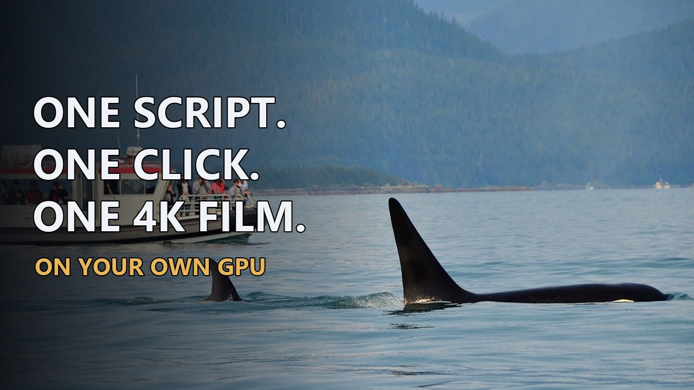

# Episode Factory

**A written script and 10-15 seconds of a voice in. A finished, narrated 4K documentary out - any length, any
style, made entirely on your own Windows PC and NVIDIA graphics card.**

▶ [Watch the 3-minute demo](https://youtu.be/Owo2AyJs0G4) · 🌐 [Website and 7-day free trial](https://localfactories.github.io/episode-factory/?utm_source=github&utm_campaign=readme)

---

## What happens after you press Run

- **It reads the whole script first.** It works out the place, the subjects and how the passages connect, finds the
  chapters, and plans the footage from what each passage means rather than from single keywords.
- **Narration in your voice.** You can tune the voice before a film (slower, faster, calmer, warmer) and keep the
  take you like.
  - Every line is transcribed back and checked against the script.
  - Hiccups and long gaps are cut.
  - Only missing or wrong words are recorded again.
- **Footage chosen sentence by sentence.**
  - For every sentence it searches free stock-footage libraries.
  - A vision model on your own card compares the candidate clips side by side and keeps the one that fits the
    words. Footage that does not match the words is refused.
  - Any gap it cannot fill honestly is named in a report.
- **A finished 4K film.**
  - The narration is mastered, the montage is cut to the words, and subtitles run one line per sentence.
  - A final check refuses a film that is not complete.
- **The upload text, written from the finished film:**
  - a title, plus four alternatives to test
  - the full description, with every chapter time
  - the tags
  - a prompt for the thumbnail
- **A clean folder at the end:**
  - the film
  - its subtitles
  - one report covering every shot and every line of the voice
  - the upload text

## Built for real machines

- It reads your card and shares it between the voice and the picture model. Films have been made end to end on 8 GB,
  12 GB and 24 GB cards.
- Installing takes one folder and one double click.
- Updates arrive inside the app, and your films and settings are kept.
- **Nothing is metered.** There are no per-minute voice bills and no credits; everything runs on your own PC.
- Example from the demo: a 1 h 54 min film took 3 h 07 min from the press to the finished 4K file, on a laptop. Short
  films work just as well, because it takes any length.

## What you need

- Windows 10 or 11.
- An NVIDIA graphics card with 8 GB or more. It does not run on a Mac.
- About 35 GB of disk space for the install.
- A free Pexels key for the stock footage. A Pixabay key is optional.
- 10-15 seconds of clean speech in a voice you have the rights to.

## Price

One plan: **GBP 19 a month, unlimited films of any length.** The first 7 days are free, and you can cancel at any time.
[Start the free trial](https://localfactories.github.io/episode-factory/?utm_source=github&utm_campaign=readme)

Questions: localfactories@gmail.com · YouTube: [@local.factories](https://www.youtube.com/@local.factories)

---

This repository also holds the program's update packages.
- `version.json` names the newest version, and every installed copy checks it once a day.
- The packages under `releases/` are encrypted. They open only from inside a purchased copy, and a licence key is
  needed to install.
